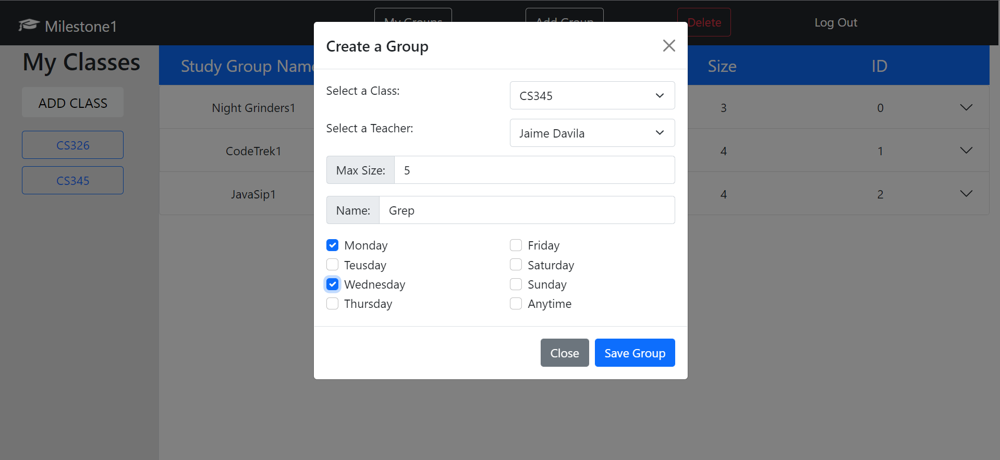
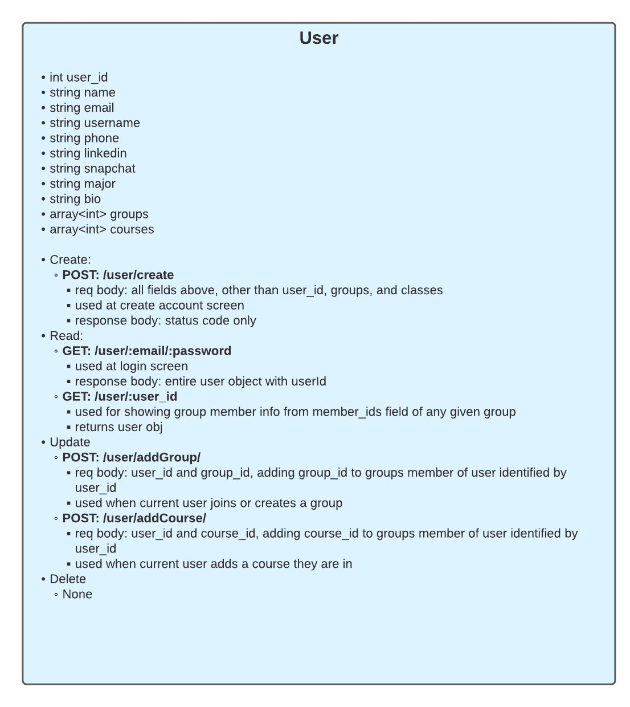
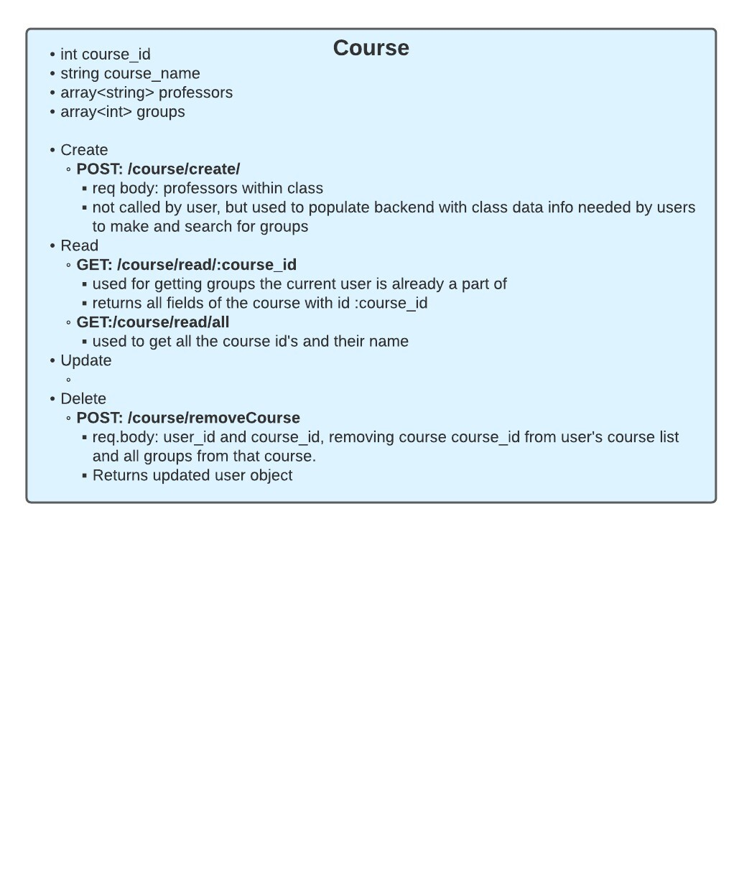
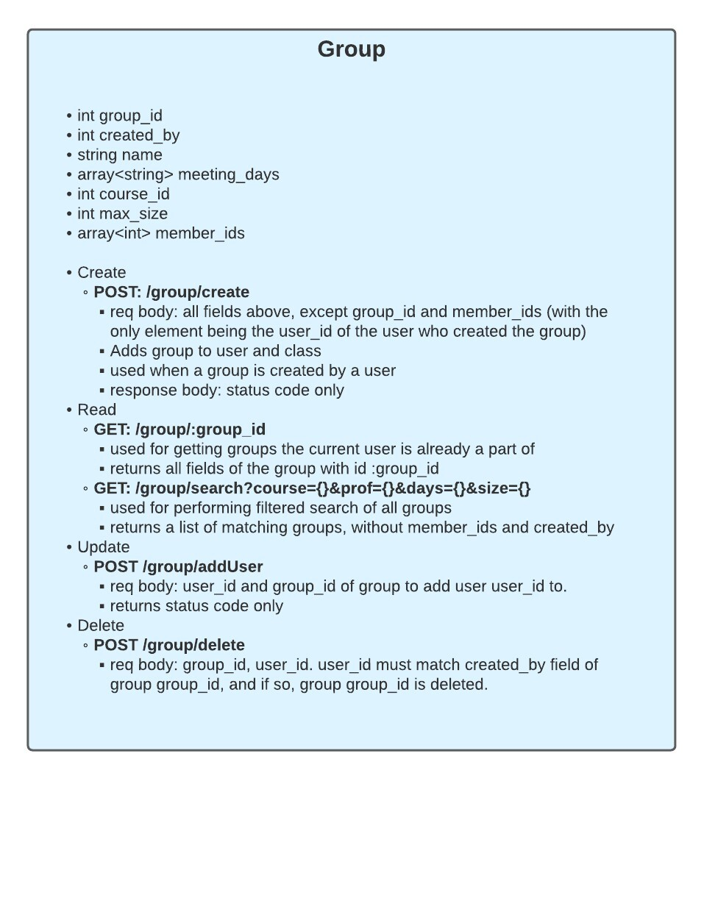

**Screenshots**

Create Group (Create) - When you click add group, you fill out a form describing the group you, the current user, are creating. When you click save changes, a POST request is made to the backend making a new group object with all the information listed in the form. This new group is given a group id in the backend and then is added to the current users and the selected class' list of groups. Thus Create Group is also an Update operation.

My Groups (Read) - When you click on my groups, we make a GET request to the backend to receive the current users attributes, where we then get the ids of the user group list. We then render the content column with an accordion item for each user group_id.

Add Class (Update) - When you click on add class, and select a class from the master list of classes, and then save changes, we update the current user object by appending course_id to the users course_list.

Delete Group (delete) - When you delete a group, we make a POST request with the group id to delete and the id of the user who is requestiong the delete. If the id matches the group creator, the group is deleted and references to that group in all other objects in storage are removed.

**API Class Diagram**

**Deployment Link**

https://shielded-spire-81354.herokuapp.com/

**Breakdown of Work**
-Alan Castillo: Implemented frontend rendering of components once data was loaded.
-Elisavet Philippakis: Connected frontend and backend with fetch statements to express endpoints.
-Sam Wallace: Created backend endpoints and server logic, deployed app to heroku.

